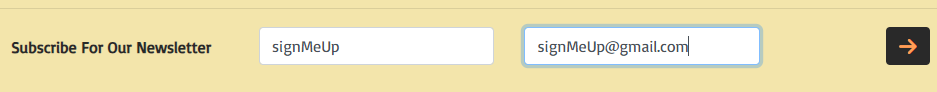
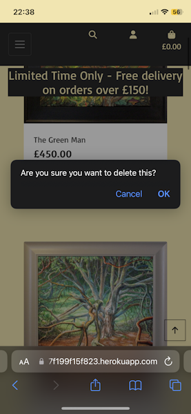

Readme.md

# Art Emporium

The purpose of this project is to implement a full-stack website. One that will provide an e-commerce platform for a store owner to aid the selling of exquisite, hand-made art. It is for demonstative purposes only.
I will implement various technologies to work together in order to achieve this aim. This site will be a combination of HTML, CSS, Javascript (in the form of JQuery), for handling the front-end. The back-end will be controlled by using Python and in particular, by implementing the Django framework. The added bonus of such being that Django comes with its ability to build an Administration area to maintain all of the necessary products, users, orders details and other information that will be stored in a database. The database will be provided at first using SQLite for development, then exported to ElephantSQL in the cloud. As the site will be hosted using Heroku, (which uses an ephemeral filesystem). All images and static files will need to be served using cloud based services. I aim to achieve this by using Amazon's Web Services.
The commerce and payment side of things will be handled by implementing the payment system provided by Stripe.

The live link can be found [here](https://art-emporium-7f199f15f823.herokuapp.com/)

## User Experience (UX)

The audience I am expecting will be rather broad. Therefore I will need to cater for user's of a wide range of technical ability and experience. I aim to provide a simplistic, visually pleasing design, with an easy to use navigation system. The ability for user's of the site to complete a transaction without hassle or confusion is paramount. I aim to provide this solution by giving the user feedback as to each stage they maybe encountering, e.g. Registration, Sign In, checkout process, etc.
In addition to this, I will expect a store user of varying technical knowledge and ability to want to maintain and be in control of adding products, and checking on transactions relating to their site.

## User Stories

### New Site Users

- As a new site user, I would like to be able to see immediately how this website is inviting me to view a range of artwork for sale.

- As a new site user, I would like to be able to view a gallery of artwork, and have the ability to easily navigate my way to various types of art products.

- As a new site user, I would like to be able to perform a search of the various products available on the website. Aiding my finding an art piece I would like to purchase.

- As a new site user, I would like to access more detail assocciated with an individul piece of art. Such as the media type used, the artist that produced it and the price and availabilty of the piece, before purchase.

- As a new site user, I would like to be able to discover information relating to each of the artists that are responsible for producing the art I see within the website.

- As a new site user, I would like to add an item I have found into a shopping bag. Allowing me to further browse the gallery for more pieces I may like to purchase. Knowing the item I have added to the shopping bag is there ready for me to complete my transaction when I am ready to do so.

- As a new site user, I would like to be able to add or remove any or all of the art work I have added to my shopping bag at any time.

- As a new site user, I would like to not have to register or sign up to the website in order to be able make a purchase of any items I may wish to purchase.

- As a new site user, I would like to be able to register myself to this website, so I may return in the future to purchase more works of art.

- As a new site user, I would like to be able to provide my name and email address in order to be added to a subscribed user's list. So that I may be able to recieve updates from the site in the future, by way of their regular newsletter.

### Returning Site Users

- As a returning site user, I would like to have my own area/profile page to keep my email address and delivery details stored. Ensuring this information is current and aiding my ability to save time with future purchases by not having to fill out all of this information everytime I wish to make a purchase.

- As a returning site user, I would like to be able to see a history of all/any of my previous purchases I have made using this website.

### Site Administrator

- As a site administrator, I should be able to login to the website and have more privileges than a general user.

- As a site administrator, I should be able to add new products to the website as they become available.

- As a site administrator, I should be able to edit any of the items currently on sale within the site.

- As a site administrator, I should be able to delete any of the items currently on sale within the site, or those that have sold.

## Design

### Colour Scheme

I have chosen a colour scheme that

- `# F3E5AB` - Vanilla. A warm yellow hue. Used for the site's logo, navigation headings and background of the website.
- `# FF9E57` - Sandy Brown. An orange colour used to highlight specific aspects of the website. Such as navigation when making a purchase, notification of a full shopping bag. Also, to indicate whether an item has sold.
- `# 292929` - Jet. A deep grey/black colour used to provide a high contrasting appearance, used in coordination with the yellow and orange colours above.
- `# 9EB9DA` - Powder Blue. Used for the home page message and any page headings.
- `# 921F2A` - Madder. A deeper red than that provided by bootstrap for use of the "text-danger" class. E.g, the "Delete" options.
- `# FFFFFF` - White. Used as the background for the shopping bag and toast message area. To provide enough of a difference in relation to the general yellow background used elsewhere.

### Typography

I have chosen three different complementing typefaces with the help of Fontjoy.com.

Playfair display sc - for use in the site logo.

- 

Mako - For use within the navigation menu and the page title text.

- 

Basic - For use as the paragraph text.

- 

- [Font Awesome](https://fontawesome.com) icons were used throughout the site, e.g. icons used for the search, user and shopping bag.

### Imagery

All images used throughout this site have been provided by kind permission of the artists featured on the site.

## Wireframes

To follow best practice, wireframes were developed for mobile, tablet, and desktop sizes.
I've used [Balsamiq](https://balsamiq.com/wireframes) to design my site wireframes.

### Registration Page Wireframes

- 

### Sign-In Page Wireframes

- 

### Sign-Out Page Wireframes

- 

### Home Page Wireframes

- 

### Products Page Wireframes

- 

### Product Details Wireframes

- 

### Shopping Bag Page Wireframes

- 

### Checkout Page Wireframes

- 

### Manage Products Page Wireframes

- 

### Edit Product Page Wireframes

- 

### Profile Page Wireframes

- 

### Artists Page Wireframes

- 

## Database Design

This project uses a relational database structure. Using software by Lucid, I have created this ER diagram that shows the tables used and there relationships to one another.

## Features

### Existing Features

**Responsive Design**

- A mobile first, responsive design to help provide site users with a similar experience across a range of web browsers and devices. I have used the Bootstrap framework to accomplish this.

**Custom Logo**

- A custom logo design for user's to easily identify the website.

**Favicon**

- A custom favicon, making it easy to identify this site alongside others in open tabs within the users browser.

**Registration System**

- A registration system to enable site visitors to create a user account. Giving them a robust and safe way to sign-in and out whenever they wish. I have used Django's Allauth in order to achieve this functionality.

**Navigation Menu**

- An easy to use navigation system for user's to travel between site areas. Implemented via the use of the Bootstrap framework.

**Gallery/Products Page**

- The Gallery/Products page features a collection of all the products on the site. Giving site visitor's instant access to investigate further any of the products and their corresponding details.

**Search Functionality**

- The search functionality appears at the top of each webpage. It provides a search box to allow user's to look up products by their name. Helping them to save time if they are looking for a particular product.
Directly beneath this, there are links provided to further breakdown their search into separate categories. Giving the user the ability to find products by Category, Artist, or Price. It also features a Special Offers link to bring back items from the database, such as New Arrivals or products of Limited Availabilty.
Alongside this, there is a "Sort By" dropbox to order the results by Category or Artist. Either alphabetically, A-Z, Z-A. It also provides the user the ability to order all products by price. Either, High to Low or Low to High respectfully.

**My Profile Page**

- The Profile page is accessable by using the My Account link. It provides a feature to allow each user their own space to store their preferred delivery details and email address. This allows the user a save time when they return to the site to make any future purchases.
- The page also includes an Order History of any previous orders they have completed.

**Shopping Bag**

- Any products the user has opted to purchase are added to a shopping bag. This is accessable at any time, from any page of the site. It allows for any adjustments to be made. E.g. Removing items, increasing items to be purchased. It also allows user's the option to return and continue shopping, or to continue to the secure checkout page in order to finalise their purchase.

**Checkout Page**

- Once a site visitor is happy with their selected product/s. The checkout page prompts the user to fill in the form presented with their details and delivery information. It also allows the user the option to tick a checkbox which will then save this delivery information to their profile. Allowing the this information to be pre-filled upon future purchases.
Once the payment field has been completed, pressing the Complete Order button finalises the transaction using Stripe services. Whilst this is completing, there is pre-loading page to ensure the user that 'something' is happening for this duration of time.

**Order Confirmation Page**

- Upon a successful purchase, the user is provided with an Order Confirmation page, detailing the shopping bag contents, price of purchase, delivery information and billing information. A "success" message is displayed using Bootstrap's Toasts components, indicating that a confirmation email will be sent to the email address provided during the purchase.

**Artists Page**

- Within the navigation system for this website, I have included a page to contain the profile information assocciated to each of the artists featured within the site. Allowing user's the ability to gain valuable information as to the artists history.

**Subscription To The Website's Newsletter**

- Within the footer of each page there features a short message to prompt site visitor's to sign up to the website's regular newsletter. If the user enters their name and email address, they are added to table within the database of "Subscribed User's" in order for the newsletter to be mailed to them at a future date. The date and time of this occurance is also logged. Checks are carried out to ensure that the form has been filled out correctly, and that the entered email address is not already stored within the database. If either fails, the user is informed of such information using the toast's messaging system.

- 

**Administration Access**

- By using backend technology, this application features all the functionality of CRUD. Giving the store owner the ability to create a new product and upload it to the database. The store owner can edit any of the products they have uploaded to the site. Lastly, the store owner can delete any of the products.

**Manage Products**

- This feature is only accessible if you are signed-in as the site administrator. It allows for full crud functionality, allowing the addition of products to the site. It provides the admin user the ability to further edit any of the products information and/or to delete the product in question. This functionality is available to access via the products page or the products detail page.

**Stock Availability**

- When the store owner or any administrative user's add a product. It comes with an "Availability" field to allow setting the number of items available to purchase of any given product. In relation to this being a site featuring one-off, unique art pieces or artwork of a limited production run. I feel this is of upmost importance as once an item is sold, it should not be available to any other user's once the transaction has been completed.
Therefore, I have restricted the Quantity field to only allow the user the option to purchase any items to this limit set by the administator. In addition to this, once an item has sold it sets the availability of the item to zero. Once this has occured. The item in question is displayed on the Products page with a Sold sign and no assocciated price or button to add the item to a shopping bag.

**Deletion Confirmation**

- As a defensive approach to the possiblity that any of the deletion options on the site are selected by mistake. I have added a pop-up message component to give the admin user, a further safety feature to confirm deletion of the product in question.

**Error Response Pages**

- If any 404 or 500 errors occur. I have implemented 'user friendly' response pages, more in keeping with the styling of the website, in order to handle these outcomes in a more elegant way than they would otherwise appear to the user.

### Future Implementations

**Contact Page**

- Add a contact page to the site. So site user's can contact the store owner with any suggestions. Or report any problems they may be experiencing.
- Add a secondary form option for any artists that would like to showcase and sell their own artwork on this platform.

**Update Registration**

- Implement Re-Capture. To defend against people mis-using the site.
- Google Authentication. To help user's sign-in seamlessly using their Google credentials.

**Further The Newsletter Subscription Service**

- Add the ability for user's to opt into receiving the newsletter by providing a checkbox option on the registration form.
- Add an `if` statement to remove the contents of the footer, if the logged in user has been found to have already opted to subscribe.
- Provide any user's that have subscribed the option to unsubscribe if they wish to do so.

**Further The Artists Page**

- Provide the store owner/admin, full crud functionality to edit and delete any of the artists information from within the context of the website, as opposed to entering the Django Admin area. In order to keep non-technical user's away from this area of the website.
- Further to the above, by adding a proper form for adding and editing the artists information. I would like to add the option of including an image of the artist in question.
- Work on improving the layout/presentation of the returned artists profile. As at present all text is displayed as a block of text without proper paragraphs.

### Accessibility

I have designed this website with the intention of making it easy for all users to navigate and enjoy.
I have tried to adhere to current best practices during the production of this website.
I have tested the website using Google Lighthouse.
Results from this can be found in the [TESTING.md](TESTING.md).

## Technologies Used

### Languages Used

HTML, CSS, and Javascript in the form of JQuery, in order to handle the front-end. Python and the Django framework to handle the back-end.

### Frameworks, Libraries & Programs Used

- [Balsamiq](https://balsamiq.com/wireframes) used to create the sites wireframes.
- [Google Fonts](https://fonts.google.com) used to import the fonts used within the site.
- [Bootstrap](https://getbootstrap.com) used as the front-end CSS framework for modern responsiveness and pre-built components.
- [Python](https://www.python.org) used as the back-end programming language.
- [Django](https:/djangoproject/.com) used as the Python framework for the site.
- [ElephantSQL](https:/elephantsql/.com) used as the relational database, cloudbase management.
- [Heroku](https://www.heroku.com) used for hosting the deployed back-end site.
- [Stripe](https://www.stripe.com) used for the e-commerce functionality.
- [AWS](https://aws.amazon.com) used for online static file and image storage.
- [Lucid](https://lucidchart.com) used for online static file and image storage.
- [Coolors](https://coolors.co/) used to help generate colour chart.
- [Fontawesome](https://fontawesome.com/) icons used throughout the site.
- [Git](https://git-scm.com) used for version control. (`git add`, `git commit`, `git push`)
amiresponsive
- [GitHub](https://github.com) used for secure online code storage.
- [Codeanywhere](https://codeanywhere.com/) used as a cloud-based IDE for development.
- Google Dev Tools - Accessed from Google Chrome.

## Deployment & Local Development

### Deployment

The live deployed application can be found on [Heroku](https://art-emporium-7f199f15f823.herokuapp.com/).

### Relational Database

This project uses [ElephantSql](https:/elephantsql/.com) for the Relational Database.

### Heroku Deployment

This project uses [Heroku](https://www.heroku.com), a platform as a service (PaaS) that enables developers to build, run, and operate applications entirely in the cloud.

### Amazon Web Services

This project uses [AWS](https://aws.amazon.com) for storing all static and images used throughout the website.

### Local Deployment

This project can be cloned or forked in order to make a local copy on your own system.

#### Cloning

You can clone the repository by following these steps:

1. Go to the [GitHub repository](https://art-emporium-7f199f15f823.herokuapp.com/)
2. Locate the Code button above the list of files and click it
3. Select if you prefer to clone using HTTPS, SSH, or GitHub CLI and click the copy button to copy the URL to your clipboard
4. Open Git shell or Terminal
5. Change the current working directory to the one where you want the cloned directory
6. In your IDE Terminal, type the following command to clone my repository:- `git clone https://art-emporium-7f199f15f823.herokuapp.com.git`
7. Press Enter to create your local clone.

#### Forking

By forking the GitHub Repository, we make a copy of the original repository on our GitHub account to view and/or make changes without affecting the original owner's repository.
You can fork this repository by using the following steps:

1. Log in to GitHub and locate the [GitHub Repository](https://github.com/Ad-White/art_emporium)
2. At the top of the Repository (not top of page) just above the "Settings" Button on the menu, locate the "Fork" Button.
3. Once clicked, you should now have a copy of the original repository in your own GitHub account!

## Testing

For all testing, please refer to the [TESTING.md](TESTING.md) file.

## Credits

### Content

| Source | Location | Notes |
| --- | --- | --- |
| [Bootstrap](https://getbootstrap.com/docs/4.6.2/getting-started/introduction/) | entire site | responsive |
| [W3Schools](https://www.w3schools.com/) | entire site | general resource |
| [Stackoverflow](https://stackoverflow.com/) | entire site | general resource |
| [Pylessons](https://pylessons.com/) | newsletter | general resource |

### Media

All images/photographs used throughout this site have been kindly permitted for me to use by each of the artists featured within the website.
  
### Acknowledgments

- I would like to thank my Code Institute mentor, Rory. For their consistant and  invaluable feedback, support and encouragement throughout the development of this project.
- I would like to thank my tutor, Ashley Oliver from the College Of West Anglia, for their understanding during what became a troublesome time, and informative responces to my questions at various stages of developing this project.
- I would like to thank my new 'Coding Buddies', Jacob and Agy, for their encouragement throughout my time at the Code Institute.
- I would like to thank my partner Chelle, for her excellent patience as a sound-board, for believing in me, and continuing to support me in making this transition into software development.
