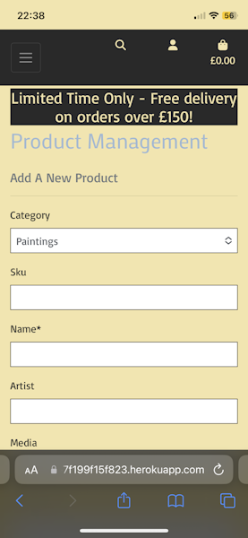

Testing.md

# Testing

Return back to the [README.md](README.md) file.

## Code Validation

### HTML

I have used the recommended [HTML W3C Validator](https://validator.w3.org) to validate my HTML.
Inital results through testing by URI and by testing by Direct Input are as follows...

Testing By URI:

| Testing URI | W3C URL | Screenshot |
| --- | --- | --- |
| By URI | [W3C](https://validator.w3.org/nu/?doc=https%3A%2F%2Fart-emporium-7f199f15f823.herokuapp.com%2F) |  |

Testing by Direct Input:

I have tested all html code, using direct input. All the resulting screenshots can be found within the documentation folder. [html screenshots](documentation/testing_html)

### CSS

I have used the recommended [CSS Jigsaw Validator](https://jigsaw.w3.org/css-validator) to validate my CSS files.
I tested my css code by URI. I have also tested each page by copying and testing by Direct Input.

| File | Screenshot | Notes |
| --- | --- | --- |
| By URI |  | Pass |
| Profile.css |  | Pass |
| Base.css |  | Pass |

### Javascript

I have used the recommended [JSHint](https://jshint.com/) to validate my javascript files.
I set the configurations to allow for jQuery and New JavaScript features (ES6).

| File | Screenshot | Notes |
| --- | --- | --- |
| Stripe |  | Three undefined variables (Stripe, document and location |
| Country Field |  | No Issues |
| Delete Confirmation |  | Two undefined variables (document and confirm) |

### Python and Jinja Syntax

I have used the [PEP8 CI Python Linter](https://pep8ci.herokuapp.com/) application in order to test my Python and Jinja syntax.

Initial results showed a few "trailing white spaces". I have been through all files and corrected any issues.
Results show that 'All is clear, no errors found'.

[Link to Python Linter Screenshots](documentation/testing_python)

## Browser Compatibility

I've tested my deployed project on multiple browsers to check for compatibility issues.

- All resulting screenshots from testing using [Chrome](documentation/chrome)
- All resulting screenshots from testing using [Firefox](documentation/firefox)
- All resulting screenshots from testing using [Safari](documentation/safari)

Results find no compatability errors or issues.

## Responsiveness

I've tested my deployed project on multiple devices to check for responsiveness issues.

- All resulting screenshots for [mobile testing](documentation/safari)
- All resulting screenshots for [tablet testing](documentation/tablet)
- All resulting screenshots for [desktop testing](documentation/chrome)

Physical testing has been conducted using mobile and desktop devices. Tablet testing has been conducted using Google Dev Tools.
All testing has resulted with devices behaving as expected.
No problems of issues detected.

## Lighthouse Audit

I've tested my deployed project using the Lighthouse Audit tool to check for any major issues.
Testing conducted for Navigation on mobile and desktop.

| Test Used | Page | Size | Screenshot |
| --- | --- | --- | --- |
| Navigation | Homepage | Mobile |  |
| Navigation | Products | Mobile |  |
| Navigation | Product Details | Mobile |  |
| Navigation | Shopping Bag | Mobile |  |
| Navigation | Artists | Mobile |  |
| --- | --- | --- | --- | --- |
| Navigation | Homepage | Desktop |  |
| Navigation | Products | Desktop |  |
| Navigation | Product Details | Desktop |  |
| Navigation | Shopping Bag | Desktop |  |
| Navigation | Artists | Desktop |  |

After my initial testing, the results suggested that I increase the contrast I had chosen for the `.home-message` and search box placeholder.
Therefore, I have since changed from the original "Powder Blue" used throughout development, to a darker shade of blue called "Yinmin Blue", (#2B4773).
This change can be seen on the deployed website.

## User Story Testing

| User Story | Screenshot |
| --- | --- |
| As a new site user, I would like to be able to see immediately how this website is inviting me to view a range of artwork for sale. |  |
| As a new site user, I would like to be able to view a gallery of artwork, and have the ability to easily navigate my way to various types of art products. |  |
| As a new site user, I would like to be able to perform a search of the various products available on the website. Aiding my finding an art piece I would like to purchase. |   |
| As a new site user, I would like to access more detail assocciated with an individul piece of art. Such as the media type used, the artist that produced it and the price and availabilty of the piece, before purchase. |  |
| As a new site user, I would like to be able to discover information relating to each of the artists that are responsible for producing the art I see within the website. |  |
| As a new site user, I would like to add an item I have found into a shopping bag. Allowing me to further browse the gallery for more pieces I may like to purchase. Knowing the item I have added to the shopping bag is there ready for me to complete my transaction when I am ready to do so. |  |
| As a new site user, I would like to be able to add or remove any or all of the art work I have added to my shopping bag at any time. |  |
| As a new site user, I would like to not have to register or sign up to the website in order to be able make a purchase of any items I may wish to purchase.|  |
| As a new site user, I would like to be able to register myself to this website, so I may return in the future to purchase more works of art. |  |
| As a new site user, I would like to be able to provide my name and email address in order to be added to a subscribed user's list. So that I may be able to recieve updates from the site in the future, by way of their regular newsletter. |  |
| As a returning site user, I would like to have my own area/profile page to keep my email address and delivery details stored. Ensuring this information is current and aiding my ability to save time with future purchases by not having to fill out all of this information everytime I wish to make a purchase. |  |
| As a returning site user, I would like to be able to see a history of all/any of my previous purchases I have made using this website. |  |
| As a site administrator, I should be able to login to the website and have more privileges than a general user. |  |
| As a site administrator, I should be able to add new products to the website as they become available. |  |
| As a site administrator, I should be able to edit any of the items currently on sale within the site.|  |
| As a site administrator, I should be able to delete any of the items currently on sale within the site, or those that have sold.|  |

## Defensive Programming

I have tried to ensure that where applicable, the features within the site behave as expected. I have entered information in an 'incorrect' manner to test the form fields throughout the site. So to ensure only the permitted data expected is accepted.
For example, not entering any data, or missing out those fields that are required on a form and trying to submit it. I have tried to increase the number of items within the shopping bag above the number that has been set in the "Availabilty" field within the database for a product. Doing so results in only the maximum permitted items of that product to be accepted.
I have tried to access the "Manage Products" area via the browser address bar, whilst not signed in as an admin user. Also, whilst I have been signed in as an accepted user without administrative priviledge.
All testing has resulted in what I hope to expect.

## Automated Testing

To date no automated testing has been conducted. Although it is on my 'to do' list.

## Bugs

Throughout developing this application, I have used Google Dev Tools to help pinpoint any errors. I have tested the deployed site as well, for functionality after development.

## Fixed Bugs

- Bug 1: A bug I had inadvertanly introduced myself whilst making sure that my python code was PEP8 compliant. I shortened a few lines of code within the settings.py file, relating to Allauth's password and verification statements. Thereby breaking the sites ability to allow any new users to register to the site. Ooops!
I have found and fixed this issue.

## Unfixed Bugs

- Bug 1: I have throughout development and deployment struggled to see why the overlay to cover the background image I had in place for the site, just does not work. I may be pretty code blind by now. So, for the moment, in order to stop it appearing within the console as an error. I have removed it. I will continue to look and find out why.

- Bug 2: Failing webhook. I have a success rate of 60% in relation to the webhook I have implemented. It relates to the payment_intent_success webhook. I have researched for hours, but have had no success myself. My mentor, Rory has also tried to help. However, it doesn't appear to be an easy fix.
Again, I will not give up on this in order to find the solution to the problem.

- Bug 3: Gmail not working. I have not been able to get gmail to work as I had hoped. As I have spent a lot of time with Bug 2. I still need to continue to research as to why the confirmation messages are not sending out. My suspicions are that it may have something to do with Google's strict security policy, and perhaps how it may have been updated?

There are no remaining bugs that I am aware of.
